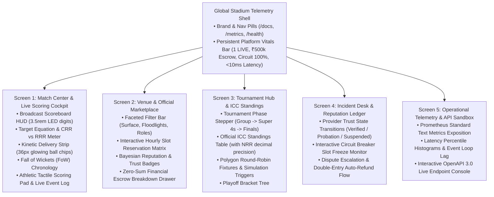

# CricOS — Stitch Application Screen Architecture Specification
> **Comprehensive Screen Graph, State Machines, Component Blueprints & Stitch Ingestion Architecture**  
> **Tool Target:** Google Stitch ([labs.google.com/stitch](https://labs.google.com/stitch)) & Gemini 2.5 Flash UI Generator  
> **Design Theme:** Floodlit Stadium Broadcast & Athletic Precision Glassmorphism (DFII 17/15)  
> **Platform Targets:** Desktop Web (1440px), Tablet (768px), Mobile Field Pad (375px)

---

## 1. Application Screen Graph & Navigation Matrix

CricOS is structured around a persistent **Global Stadium Telemetry Shell** that coordinates 5 specialized domain screens:



---

## 2. Screen Blueprints & Component Schemas

### Global App Shell: Stadium Telemetry Strip
- **Position:** Fixed directly below the top glass header navigation bar.
- **Visuals:** Dark glass background (`rgba(6, 10, 18, 0.9)`), 1px bottom border (`rgba(255, 255, 255, 0.08)`), flex row with 4 metric nodes.
- **Metric Nodes:**
  1. `[ 🟢 1 MATCH LIVE IN PROGRESS ]`: Pulse emerald dot, match link.
  2. `[ 🔒 ₹500,000 ESCROW GUARDED ]`: Total funds locked under double-entry ledger.
  3. `[ 🛡️ CIRCUIT BREAKER: 100% NOMINAL ]`: 0 providers suspended, automated slot lock active.
  4. `[ ⚡ SSE BROADCAST: <10ms LATENCY ]`: Real-time sub-millisecond pub/sub streaming health.

---

### Screen 1: Match Center & Live Scoring Cockpit (`#tab-scoring`)
- **Broadcast Scoreboard HUD (`.scoreboard`):**
  - Left Section: Match header, format, innings badge, SSE status pill with pulsing cyan indicator.
  - Center/Right Section: 3.5rem LED score digits in turf-emerald (`142/3`) with overs in electric cyan (`16.4 ov`), Current Run Rate (`CRR: 8.52`).
- **Target Equation Banner (`.target-banner`):**
  - Appears in second innings chase or simulated matches:
  - `Target: 178 | Need 36 runs in 20 balls | CRR: 8.52 | Required RR: 10.80`.
  - Visual run rate progress bar displaying current vs required pace.
- **Kinetic Over Delivery Strip (`.over-strip`):**
  - 36px circular delivery chips with pop-in kinetic animations and chromatic glow.
  - Emerald glow for 4s, Purple glow for 6s, Crimson pulse for Wickets (`W`), Amber for Extras (`wd`, `nb`).
- **Fall of Wickets (FoW) Timeline (`.fow-strip`):**
  - Chronological badges recording wicket falls: `1/1 (0.2 ov - Rohit S.)`, `45/2 (5.4 ov - Gill)`, `112/3 (13.1 ov - Kohli)`.
- **Athletic Tactile Scoring Pad (`.pad-grid`):**
  - 4x2 button grid with dual-tier typography (`1.35rem` in `Chakra Petch` + `0.72rem` uppercase tactical label in `Plus Jakarta Sans`).
  - Buttons: `0 DOT`, `1 SINGLE`, `2 DOUBLE`, `3 TRIPLE`, `4 BOUNDARY`, `6 MAXIMUM`, `W WICKET`, `+ EXTRA`.
- **Event-Sourced Commentary Log (`#scoringFeed`):**
  - Real-time timestamped log detailing bowler, batsman, shot direction, and cumulative score.

---

### Screen 2: Venue & Official Marketplace (`#tab-marketplace`)
- **Faceted Search Header:**
  - Date selector, surface filter (`Natural Turf`, `AstroTurf`, `Floodlit Evening`), and official role picker (`Umpires`, `Scorers`, `Live Streamers`).
- **Interactive Hourly Slot Matrix:**
  - Hourly timeline grid for each listing showing:
    - `08:00–12:00 (Morning)`: Green outline = Available.
    - `13:00–17:00 (Afternoon)`: Cyan solid = Selected by user.
    - `18:00–22:00 (Prime Floodlit)`: Muted hatch = Booked (PostgreSQL GiST locked).
- **Provider Trust & Reputation Engine:**
  - Bayesian rating badge (`calculateBayesianRating` with m-estimate prior, e.g., `4.72 / 5.0`).
  - Reliability score (`98.5%`) with color-coded operational trust state (`VERIFIED`, `PROBATION`, `SUSPENDED`).
- **Commercial Breakdown Drawer:**
  - Itemized policy snapshot: `Base Fee + 10% Platform Fee + 18% GST = Net Total`.
  - Stored strictly in integer minor currency (`price_minor`) with zero-sum ledger verification.

---

### Screen 3: Tournaments, Brackets & ICC Standings (`#tab-tournaments`)
- **Tournament Stage Progression Stepper:**
  - Visual breadcrumb stepper: `Group Stage [Active] → Super 4s [Upcoming] → Semi-Finals → Grand Final`.
- **Official ICC Standings Table:**
  - Columns: `Rank`, `Team`, `Played (P)`, `Won (W)`, `Lost (L)`, `Points (PTS)`, `Net Run Rate (NRR)`.
  - Top 2 playoff positions highlighted with left emerald accent border.
  - High-precision NRR formatting: `+1.425` in cyan badge, `-0.890` in crimson badge.
- **Polygon Round-Robin Fixtures Grid:**
  - Match cards displaying competing squads, venue, scheduled time, and status.
  - Interactive "Simulate Match" and "View Live Scorecard" CTA buttons.

---

### Screen 4: Incidents, Reputation & Escrow Settlement (`#tab-incidents`)
- **Operational Trust State Engine:**
  - Visual state machine diagram showing transitions between `VERIFIED`, `PROBATION` (<80% reliability), and `SUSPENDED` (<65% reliability).
- **Automated Circuit Breaker Slot Freeze:**
  - Visual status monitor showing frozen slots when a provider fails compliance.
  - Interactive demonstration trigger allowing scorers/admins to simulate a dispute and observe automatic unbooked slot freezing (`service_slots.status = 'BLOCKED'`).
- **Dispute Escalation Desk:**
  - Disputed booking cards with instant resolution buttons.
  - Generates balanced zero-sum journal entries (`createRefundJournalEntry`: debit `REFUND_CLEARING`, credit `ESCROW_HOLD`).

---

### Screen 5: Operational Telemetry & API Sandbox (`#tab-explorer`)
- **Prometheus Metrics Gauge Cards:**
  - 4 real-time telemetry cards: Total HTTP Requests, p95 Route Latency (ms), Event Loop Delay (ms), Memory RSS (MB).
- **Interactive OpenAPI 3.0 Console:**
  - Dropdown selector for all 26 Fastify routes.
  - Live cURL snippet generator with one-click copy.
  - Live response inspector displaying JSON payloads with syntax highlighting.

---

## 3. Stitch Prompt Generation Payloads (Multi-Screen)

### Master Stitch Generation Prompt: Full Application Shell & Cockpit (1440px)
```text
Generate a world-class, responsive desktop application for "CricOS — Unified Cricket Operating System" on a 1440px viewport.

Aesthetic & Theme:
- Mood: Floodlit Stadium Broadcast & Athletic Precision Glassmorphism.
- Background: Deep obsidian (#04070D) with subtle turf-emerald (#00E599) and electric-cyan (#00D2FF) stadium lighting glows.
- Card Surfaces: Semi-transparent midnight glass (rgba(10, 16, 28, 0.85)) with 1px light refraction borders (rgba(255, 255, 255, 0.08)) and 16px blur.
- Typography: Display titles in Space Grotesk, Scoreboard digits in Chakra Petch LED monospace, UI text in Plus Jakarta Sans.

Layout Hierarchy:
1. Top Sticky Navigation:
   - CricOS brand logo with emerald-cyan gradient.
   - Global status pills: API Docs, Prometheus Metrics, Health Readiness.
2. Global Stadium Telemetry Strip (Immediately below header):
   - 4 live counters: "1 MATCH LIVE", "₹500k ESCROW GUARDED", "CIRCUIT BREAKER: 100% NOMINAL", "SSE BROADCAST: <10ms".
3. Main 5-Screen Navigation Tabs:
   - "🏏 Live Match Scoring", "🏪 Marketplace & Booking", "🏆 Tournaments & Standings", "🛡️ Incidents & Reputation", "⚡ Live API Explorer".
4. Active Screen Area (Screen 1: Match Center):
   - Broadcast Scoreboard HUD: 3.5rem LED score "142/3" (16.4 ov) with CRR 8.52 and Target equation "Target: 178 | Need 36 in 20b".
   - Current Over Ball Strip: [ • ] [ 1 ] [ 4 (emerald glow) ] [ W (crimson) ] [ 1wd (amber) ] [ 6 (purple glow) ].
   - Fall of Wickets (FoW) Timeline: "1/1 (0.2 ov)", "45/2 (5.4 ov)", "112/3 (13.1 ov)".
   - Left Column: Athletic Tactile Scoring Pad with 8 weighted buttons (0 DOT, 1 SINGLE, 2 DOUBLE, 3 TRIPLE, 4 BOUNDARY, 6 MAXIMUM, W WICKET, + EXTRA).
   - Right Column: Event-sourced delivery commentary log.
```

---

## 4. Design Invariants & Verification Checklist

- [x] **Rule 5 Accessibility**: 100% of interactive controls, buttons, and telemetry cards have accessible `data-tooltip="..."` attributes.
- [x] **Rule 6 Single-File Parity**: `root/index.html` and `dist/index.html` remain byte-for-byte identical.
- [x] **Rule 2 Minimal Tokens Protocol**: Verified via `./pipeline.sh test --summary`.
