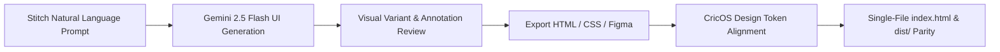

# CricOS — Stitch UI Design Requirements Specification
> **Google Stitch Design Document & Prompt Architecture**  
> **Aesthetic Theme:** Floodlit Stadium Broadcast & Athletic Precision Glassmorphism  
> **Target Tool:** Google Stitch ([labs.google.com/stitch](https://labs.google.com/stitch)) / Gemini 2.5 Flash UI Generator  
> **Target Viewports:** Responsive Web (Desktop 1440px, Tablet 768px, Mobile 375px)  
> **DFII Score:** 17/15 (Distinctiveness, Aesthetic Quality, Coherence)

---

## 1. Executive Concept & Stitch Ingestion Protocol

### Stitch System Role
```text
You are a Principal Athletic UI/UX Designer and Live Broadcast Systems Engineer.
Your task is to generate high-fidelity, world-class UI screens for "CricOS" — the Unified Cricket Operating System.
Designs must feel like a premier international night-match cricket broadcast combined with an elite aerospace control cockpit.
Strictly avoid generic corporate templates, flat white cards, default system fonts, and generic AI purple glows.
```

### Visual Atmosphere Directives
- **Atmospheric Density:** `7/10` (Cockpit-Balanced High-Density Sports Analytics)
- **Visual Variance:** `6/10` (Asymmetric Broadcast HUD & Split-Screen Control Centers)
- **Motion Philosophy:** `7/10` (Kinetic LED Scoreboard Digits, Pop-In Delivery Chips, Micro-Interactions)
- **Atmosphere Summary:** Deep night-match floodlit stadium ambiance. Dark obsidian turf background accented with electric emerald (`#00E599`) and cyan (`#00D2FF`) floodlight halos, luminous LED scoreboard digits, and high-contrast glassmorphic card layers.

---

## 2. Color Palette & Semantic Roles

| Token Name | Hex Code / Value | Functional & Semantic Role |
| :--- | :--- | :--- |
| **Obsidian Base** | `#04070D` | Deepest background canvas, simulating night match darkness |
| **Glass Card Fill** | `rgba(10, 16, 28, 0.82)` | Semi-transparent card surfaces with `backdrop-filter: blur(16px)` |
| **Solid Card Surface** | `#0A101C` | High-contrast container fill for inputs and tables |
| **Turf Emerald (Primary)** | `#00E599` | Primary action CTAs, LED main scores, Boundary 4s, Active Status |
| **Turf Glow** | `rgba(0, 229, 153, 0.35)` | Box-shadow aura for live elements and active score figures |
| **Electric Cyan (Accent)** | `#00D2FF` | Live over rate badges, SSE stream pulse dot, secondary interactive pills |
| **Broadcast Gold / Amber** | `#FFB800` | Extras (Wides/No-Balls), Bayesian reputation ratings, alerts |
| **DRS Crimson / Rose** | `#FF3366` | Wickets (`W`), circuit-breaker suspensions, dispute warnings |
| **Maximum Violet / Purple** | `#A855F7` / `#C084FC` | Sixes (`6`), tournament winners, championship badges |
| **Light Refraction Border** | `rgba(255, 255, 255, 0.08)` | 1px border lines on glassmorphic cards and dividers |
| **Text Primary** | `#F8FAFC` | Crisp display headings, primary values, active tab labels |
| **Text Muted** | `#94A3B8` | Secondary labels, bowler economy, timestamps, helper text |

---

## 3. Typographic Architecture

| Hierarchy Role | Recommended Font | Fallback Stack | Weights | Usage Invariants |
| :--- | :--- | :--- | :--- | :--- |
| **Display Headings** | `Space Grotesk` | `-apple-system, sans-serif` | `700, 800` | Section titles, brand title, modal headers. Letter spacing: `-0.02em`. |
| **Scoreboard LED Digits** | `Chakra Petch` | `monospace` | `600, 700, 800` | 3.5rem main score (`142/3`), overs (`16.4 ov`), run rates, bowling figures. |
| **Body & Interactive UI** | `Plus Jakarta Sans` | `Inter, BlinkMacSystemFont` | `400, 500, 600, 700` | Field labels, tab labels, card descriptions, data tables. |
| **Code & Minor Units** | `JetBrains Mono` | `Courier New, monospace` | `400, 500` | Ledger hashes, integer minor currency (`₹4,500.00`), OpenAPI routes. |

> [!IMPORTANT]
> **Typography Anti-Patterns in Stitch**:
> - Never use default serif fonts (`Times New Roman`, `Georgia`).
> - Never use generic `Inter` for scoreboard digits or display banners.
> - All live cricket numbers and rates must use tabular/monospace or `Chakra Petch` LED styling.

---

## 4. Core Component Blueprints

### Component A: Broadcast Scoreboard HUD (`.scoreboard`)
- **Structure:** Full-width glass banner at the top of the Match Center.
- **Visuals:** Dual-layer radial gradient (`rgba(0, 229, 153, 0.12)` to `rgba(0, 210, 255, 0.07)`), 1px border (`rgba(0, 229, 153, 0.35)`), rounded `16px`.
- **Content:**
  - Left: Match Title (`Delhi Daredevils vs Mumbai Super Strikers`), format (`T20 Championship`), innings status, live SSE connection badge with cyan pulsing dot.
  - Right: Huge 3.5rem LED score in Turf Emerald (`142/3`) with 25px glow, Overs in Electric Cyan (`16.4 ov`), Current Run Rate (`CRR: 8.52`), Required Run Rate (`RRR: 9.15`).
  - Bottom Strip: Active Batsmen cards (Striker with `★ ON STRIKE` badge, balls faced, strike rate) + Active Bowler card (figures `2.4-0-18-2`, economy rate).

### Component B: Kinetic Over Ball Strip (`.over-strip`)
- **Structure:** Horizontal flex container representing the current over's deliveries.
- **Ball Chips (`.ball-bubble`):** 36px circular badges with 1px border and hover scale (1.15x).
- **Styling Rules:**
  - Dot Ball (`·` or `0`): Neutral subtle gray border (`#94A3B8`).
  - Single / Two (`1`, `2`, `3`): Light glass pill with white digit.
  - Boundary Four (`4`): Glowing turf emerald chip (`#00E599`) with green shadow.
  - Boundary Six (`6`): Glowing purple chip (`#C084FC`) with violet shadow.
  - Wicket (`W`): Crimson chip (`#FF3366`) with red glow.
  - Extra (`wd`, `nb`): Warm amber chip (`#FFB800`) with gold glow.

### Component C: Athletic Tactile Scoring Pad (`.scoring-pad`)
- **Structure:** 4x2 responsive button grid for scorers and field umpires.
- **Buttons:** 
  - Dual-tier typography: large digit (`1.35rem` in `Chakra Petch`) centered above uppercase micro-label (`0.72rem` in `Plus Jakarta Sans`, e.g., `DOT`, `SINGLE`, `BOUNDARY`, `MAXIMUM`, `WICKET`, `EXTRA`).
  - Micro-interactions: `-1px` transform on hover, `0.96` scale on click.
  - Tooltip: Each button must include contextual guidance (e.g., `data-tooltip="Record 4 runs (Boundary)"`).

### Component D: Provider Marketplace & Booking Timeline
- **Structure:** 2-column or 3-column asymmetric card grid.
- **Features:**
  - Venue card: Name, surface type (`Natural Turf / Floodlit`), hourly rate in minor currency (`₹2,500/hr`).
  - Bayesian Reputation Engine: Star score (`4.72 / 5.0`), reliability meter (`98.5%`), operational trust badge (`VERIFIED` in green, `PROBATION` in amber, `SUSPENDED` in crimson).
  - Slot Picker: Timeline visual showing booked vs available hours with GiST conflict protection badge.

### Component E: Tournament Standings & Round-Robin Brackets
- **Structure:** Tabbed view with Standings Table and Fixtures Schedule.
- **Standings Table:** Columns: `Team`, `Played (P)`, `Won (W)`, `Lost (L)`, `Points (PTS)`, `Net Run Rate (NRR)`.
- **Styling:** Alternating subtle dark rows, top 2 teams highlighted with emerald playoff indicator, positive NRR in cyan, negative NRR in crimson.

---

## 5. Ready-to-Run Stitch UI Generation Prompts

### Prompt 1: Live Match Center & Scoring Console (Desktop Web, 1440px)
```text
Design a premier cricket live match center and scoring console for CricOS on a 1440px desktop viewport.

Theme & Style:
- Aesthetic: Floodlit Stadium Broadcast & Athletic Precision Glassmorphism.
- Colors: Deep obsidian canvas (#04070D), semi-transparent midnight cards (rgba(10, 16, 28, 0.85)) with 1px subtle white borders (rgba(255, 255, 255, 0.08)).
- Accents: Turf emerald (#00E599), electric cyan (#00D2FF), DRS crimson (#FF3366), and stadium purple (#A855F7).
- Typography: Display titles in Space Grotesk, scoreboard digits in Chakra Petch LED monospace, body text in Plus Jakarta Sans.

Key Components on Screen:
1. Top Sticky Navigation:
   - CricOS brand logo with turf-emerald and cyan gradient.
   - Live SSE connection indicator with animated pulsing dot.
   - Quick navigation pills for API Docs, Prometheus Metrics, and Health Probes with subtle glass borders.
2. Broadcast Scoreboard Banner:
   - Match: "Delhi Daredevils vs Mumbai Super Strikers" (T20 Championship, Match 1).
   - Massive 3.5rem LED score "142/3" in glowing turf emerald with overs "16.4 ov" in electric cyan.
   - Run rate badges: CRR 8.52, RRR 9.15.
   - Striker card: "Virat K. ★ ON STRIKE" (48 off 32b, SR 150.0). Non-striker: "Rohit S." (34 off 24b).
   - Bowler card: "Jasprit B." (3.4-0-24-2, Econ 6.54).
3. Current Over Delivery Strip:
   - 36px circular delivery chips showing the over progression: [ • ] [ 1 ] [ 4 (green glow) ] [ W (crimson) ] [ 1wd (amber) ] [ 6 (purple glow) ].
4. Two-Column Workspace Layout:
   - Left Column: Interactive Ball-by-Ball Scoring Pad with 8 athletic tactile buttons (0 DOT, 1 SINGLE, 2 DOUBLE, 3 TRIPLE, 4 BOUNDARY, 6 MAXIMUM, W WICKET, + EXTRA).
   - Right Column: Live commentary event stream showing ball timestamps, bowler actions, and cumulative scores in monospace.
```

---

### Prompt 2: Mobile Field Scorer & Umpire Pad (Mobile, 375px)
```text
Design a mobile-first live cricket scoring interface for field scorers and umpires on a 375px mobile screen.

Theme & Style:
- Aesthetic: High-contrast athletic dark mode optimized for outdoor sunlight visibility.
- Colors: Deep obsidian (#04070D), high-visibility turf emerald (#00E599), bright cyan (#00D2FF), and bright crimson (#FF3366).
- Typography: Large LED numbers in Chakra Petch, UI controls in Plus Jakarta Sans.

Key Components on Screen:
1. Compact Mobile Header:
   - CricOS logo, match status pill "LIVE 2nd Innings", and offline-sync cached indicator.
2. Sticky Mobile Scoreboard Card:
   - Overs & Target: "Target: 178 | Need 36 runs in 20 balls".
   - Score: "142/3" (16.4 ov).
   - Active batsmen and bowler in compact two-line rows.
3. Thumb-Friendly Kinetic Delivery Strip:
   - Scrollable ball bubble row showing current over balls [ • ] [ 1 ] [ 4 ] [ W ] [ 6 ].
4. Oversized Touch-Target Scoring Pad (4x2 Grid):
   - Minimum 60px tap targets for one-handed thumb entry.
   - Distinct color-coded buttons: Emerald for 4, Purple for 6, Crimson for Out/Wicket.
5. Quick Action Drawer:
   - Buttons for DRS Review, Bowler Change, Extras Modifier (No-Ball / Bye / Leg-Bye), and End of Over Confirmation.
```

---

### Prompt 3: Venue Marketplace & Instant Slot Booking (Desktop Web, 1440px)
```text
Design a venue and match official marketplace dashboard for CricOS on a 1440px desktop screen.

Theme & Style:
- Aesthetic: Modern athletic luxury with glassmorphism and subtle lighting refractions.
- Colors: Obsidian (#04070D), dark midnight navy cards, turf emerald highlights (#00E599), and warm amber (#FFB800) for review stars.
- Typography: Space Grotesk headings, Plus Jakarta Sans body, JetBrains Mono for prices.

Key Components on Screen:
1. Marketplace Filter Bar:
   - Date picker, time range, venue type (Natural Turf, AstroTurf, Floodlit), and official roles (Umpires, Scorers, Live Streamers).
2. Venue Cards Grid (3 Columns):
   - Card 1: "Harbour Cricket Grounds — Pitch 1"
     - Floodlit night turf, pavilion included, DRS camera setup.
     - Price: "₹2,500 / hr" in JetBrains Mono.
     - Bayesian Trust Badge: "VERIFIED (98.5% Reliability, 4.72★)".
     - Interactive Slot Timeline: Hours 18:00–22:00 showing available slots in emerald and booked slots in muted gray.
     - Primary Button: "Book & Escrow Slot" with emerald-cyan gradient.
   - Card 2: "Lord's Arena — Box Turf"
     - Covered indoor turf, bowling machine included.
     - Price: "₹1,800 / hr". Trust Badge: "VERIFIED (4.85★)".
3. Commercial Transparency Drawer:
   - Shows gross fee breakdown: Base Price + 10% Platform Fee + 18% GST = Net Total in integer minor currency with zero-sum escrow guarantee.
```

---

### Prompt 4: Tournament Hub, Bracket & ICC Standings (Desktop Web, 1440px)
```text
Design a comprehensive cricket tournament management dashboard for CricOS on a 1440px desktop screen.

Theme & Style:
- Aesthetic: Broadcast sports presentation with geometric precision.
- Colors: Obsidian dark mode (#04070D), gold/amber championship accents (#FFB800), turf emerald (#00E599), and electric cyan (#00D2FF).
- Typography: Space Grotesk titles, Chakra Petch for standings points and Net Run Rate, Plus Jakarta Sans for table rows.

Key Components on Screen:
1. Tournament Banner:
   - "Premier Super League 2026 — Group Stage & Knockouts".
   - Status badge "ROUND 4 OF 6 IN PROGRESS", prize pool badge "₹500,000 Escrow Locked".
2. Standings & League Table:
   - Columns: Rank, Team Name, Played (P), Won (W), Lost (L), Tie (T), Points (PTS), Net Run Rate (NRR), Form Guide (Last 5).
   - Top 2 playoff positions highlighted with left emerald border accent.
   - NRR displayed with high-precision decimals (+1.425 in cyan, -0.890 in crimson).
3. Round-Robin Fixtures & Results Grid:
   - Match cards showing competing team badges, date/time, venue name, and simulated or live match status.
   - Knockout tree bracket preview for Semi-Finals and Grand Final.
```

---

## 6. Strict Anti-Patterns (Banned AI Clichés)

When evaluating or generating screens with Stitch, enforce these strict prohibitions:

1. **NO Generic AI Purple/Blue Neon Glows:** Do not generate fuzzy purple light leaks or oversaturated neon buttons. All glows must be grounded in athletic lighting (turf emerald `#00E599`, broadcast cyan `#00D2FF`, DRS crimson `#FF3366`).
2. **NO System Default Fonts:** Strictly avoid `Inter`, `Roboto`, or generic sans-serif for scoreboards. Always use `Chakra Petch` or athletic geometric monospace.
3. **NO Pure Pitch Black (`#000000`):** Use deep obsidian `#04070D` or zinc-tinted midnight `#0A101C` to preserve contrast without causing optical eye strain.
4. **NO 3-Equal-Box SaaS Grids:** Break monotony with asymmetric cards (e.g., 60/40 scoreboard split, 2-column tactical pad, slot timelines).
5. **NO Emojis as UI Icons:** Use clean SVG vector icons or athletic symbol badges (`★`, `🏏`, `⚡`, `🛡️`).
6. **NO Unverified Placeholder Names:** Always use realistic cricket entities (`Delhi Daredevils`, `Mumbai Super Strikers`, `Virat K.`, `Jasprit B.`, `Harbour Cricket Grounds`).
7. **NO Floating Point Currency:** All monetary pricing must be formatted cleanly with proper minor unit representations (`₹2,500.00`).

---

## 7. Stitch Export & Hand-off Pipeline



1. **Generate in Stitch:** Copy one of the 4 prompts above into [labs.google.com/stitch](https://labs.google.com/stitch).
2. **Iterate with Annotations:** Use Stitch's "annotate to edit" tool to fine-tune spacing, badge positions, or color contrast.
3. **Export Clean HTML/CSS:** Export the generated code, extract structural components, and map CSS classes directly to CricOS design tokens (`--turf-emerald`, `--font-score`, `--font-display`).
4. **Deploy & Verify:** Run `./pipeline.sh test --summary` and `pnpm verify:dist` to maintain 100% test passing and single-file release parity.
