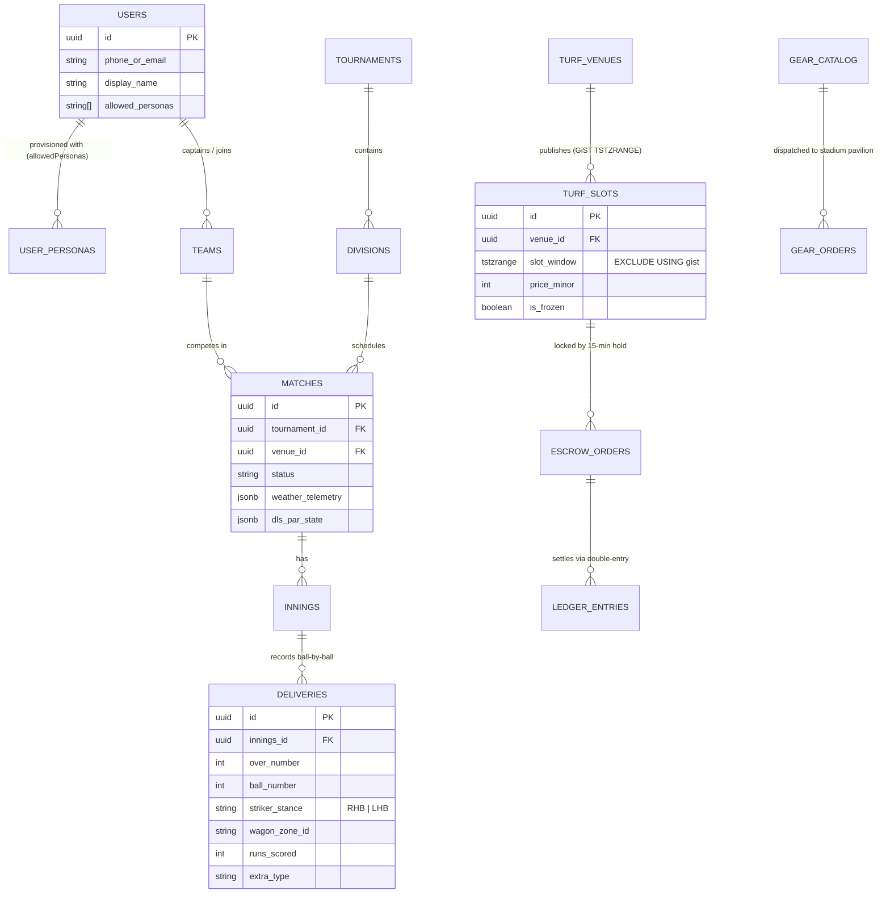

# 01 — Principal Architecture Guide

> **Target Audience**: Principal / Staff Engineers, System Architects, Technical Leads.

---

## 1. The Core Architectural Insight

Grassroots and semi-professional cricket platforms traditionally fail under two real-world physical conditions:
1. **Unreliable stadium/turf cellular connectivity** (causing WebGL/CDN assets to blank out and ball-by-ball scoring requests to drop mid-over).
2. **Race-condition double-bookings** on popular floodlight turf slots and officiating assignments when multiple captains check out simultaneously.

**CricOS solves both problems through a Unified Offline-First Self-Contained Distribution + PostgreSQL GiST & Double-Entry Escrow Architecture:**
- Every UI bundle (`apps/api/src/ui/dashboard.ts` $\rightarrow$ `dist/index.html` and `apps/api/src/ui/mobile-view.ts` $\rightarrow$ `dist/mobile.html` $\rightarrow$ `dist/cricos-debug.apk`) compiles into a **100% self-contained artifact** with a built-in **Zero-Dependency 60fps 3D Perspective Camera Projection Engine** (`MobileThreeStadiumPitch.prototype.renderScene3D` at `apps/api/src/ui/mobile-view.ts:4420`) alongside Three.js WebGL, plus a local SQLite/IndexedDB outbox queue (`OfflineScoringQueue.java`).
- On the backend, turf slots are protected at the database kernel level by PostgreSQL `btree_gist` exclusion constraints (`TSTZRANGE` overlap prevention) paired with a double-entry financial escrow ledger (`migrations/0003_marketplace_escrow.sql`).

### Cross-Language Mental Model (Python Pseudocode Comparison)

If expressed in Python, the core CricOS synchronization & 3D dual-renderer invariant looks like this:

```python
class CricOSUnifiedRuntime:
    def record_delivery_and_render(self, ball_event: dict, batter_stance: str):
        # 1. True Cricket Semantic Invariant: OFF-SIDE vs ON-SIDE never flips its meaning;
        #    only the physical Left/Right compass angle mirrors across the pitch axis (X -> -X).
        is_off_side = (ball_event["zone_side"] == "OFF")
        mirrored_angle = (360 - ball_event["angle_deg"]) % 360 if batter_stance == "LHB" else ball_event["angle_deg"]

        # 2. Dual-Engine 3D Viewport Rebinding: Never trust stale DOM canvas references after re-render
        live_canvas = document.getElementById("mobileThreeStadiumCanvas")
        if self.stadium_3d.canvas is not live_canvas:
            self.stadium_3d.rebind_canvas(live_canvas)
        self.stadium_3d.render_60fps_perspective(mirrored_angle, is_off_side)

        # 3. Idempotent Offline-First Delivery Queue -> Server Reconciliation
        self.offline_outbox.enqueue(idempotency_key=ball_event["uuid"], payload=ball_event)
        self.enforce_wcag_aaa_contrast_invariants()
```

---

## 2. Domain Model & Entity-Relationship Diagram



---

## 3. Key Architectural Subsystems & File Citations

| Subsystem | Primary Source File & Line Range | Architectural Responsibility |
| :--- | :--- | :--- |
| **Fastify API & Route Bootstrap** | [`apps/api/src/main.ts:1-220`](../apps/api/src/main.ts) | Registers REST routes, Prometheus `/metrics`, OpenAPI 3.0 `/docs`, WebSocket streams, and static bundle serving |
| **Desktop Unified Console & 3D/Wagon/Gear Engine** | [`apps/api/src/ui/dashboard.ts:1-21104`](../apps/api/src/ui/dashboard.ts) | Complete Desktop Web Console, 3D WebGL Stadium (`ThreeJsStadiumPitch`), RHB/LHB Wagon Wheel, Intelligent Weather (`VENUE_WEATHER_PROFILES`), and Pro Gear Store (`GEAR_STORE_CATALOG`) |
| **Mobile & Android APK Standalone Engine** | [`apps/api/src/ui/mobile-view.ts:1-10550`](../apps/api/src/ui/mobile-view.ts) | `StandaloneMobileApp` 8-persona state machine, Slide-Out Left Sidebar (`#mobileSidebarDrawer`), Zero-Dependency 3D Perspective Engine, and Mobile Pro Gear Store |
| **Android Native Bridge & Offline SQLite Queue** | [`apps/mobile/android/app/src/main/java/com/cricos/mobile/WebAppInterface.java`](../apps/mobile/android/app/src/main/java/com/cricos/mobile/WebAppInterface.java) | `@JavascriptInterface` native bridge for haptic feedback, native share sheets, and SQLite ball-by-ball offline queue (`OfflineScoringQueue.java`) |
| **Production Distribution Packager** | [`scripts/package-dist.mjs:1-180`](../scripts/package-dist.mjs) | Generates byte-for-byte identical `index.html` & `dist/index.html`, `dist/mobile.html`, `dist/openapi.json`, Android/iOS native assets, and SHA-256 `release-manifest.json` |

---

## 4. Strategic Design Tradeoffs

1. **Zero-Build-Step Runtime Parity vs Heavy SPA Bundlers**:
   - By generating self-contained HTML/CSS/JS bundles directly from TypeScript UI modules (`dashboard.ts` and `mobile-view.ts`) via `scripts/package-dist.mjs`, CricOS guarantees **zero external CDN failure modes** inside the Android APK WebView and sub-500ms cold starts.
2. **Synchronous WCAG 2.1 AA/AAA Contrast Enforcement**:
   - Both `enforceThemeContrastInvariants()` (`dashboard.ts:15490`) and `StandaloneMobileApp.prototype.enforceContrastInvariants()` (`mobile-view.ts:3605`) walk live DOM and SVG `<text>` nodes across `swiss`, `nordic`, and `stadium` themes, alpha-compositing background chains to guarantee `>= 4.65:1` normal text and `>= 7.5:1` primary UI contrast.
