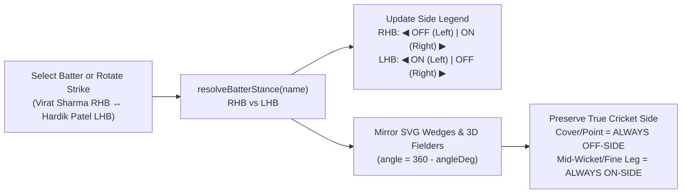

# 03 — Live Scoring, 3D Stadium & Dynamic RHB/LHB Wagon Wheel

---

## 1. Ball-by-Ball Scoring Studio (`apps/api/src/ui/dashboard.ts` & `mobile-view.ts`)

- **Strict Role Gating (`SCORER` Exclusive)**:
  - On both Desktop (`#studioScoringControlsGroup`) and Mobile/APK (`#mobileScorerStudioPad`), the ball-by-ball scoring keypad (`0`, `1`, `2`, `3`, `4`, `6`, `W`, `Undo`, `Wide`, `No Ball`, `Leg Bye`, `Bye`) is rendered **exclusively** when `persona === 'SCORER'`.
  - When `CAPTAIN` views the live match, `#mobileCaptainTacticalCenter` (`👑 Captain Tactical & Field Strategy Center`) is shown with `Target Runs`, `Balls Left`, `Required RR`, and 1-tap tactical triggers (`🎯 Field Radar`, `🧬 Win Simulator`, `🏏 Playing XI`).
- **Deduplicated Sonner Toast Notification Engine (`createToast()` & `showToast()`)**:
  - Switching batter stance (`RHB`/`LHB`), filtering the Wagon Wheel by batter, rotating strike (`swapStudioStrike`), and recording deliveries propagate `silent = true` across internal cascading calls and deduplicate prefix tags (`Batsman stance:`, `Wagon Zone:`, `Strike swapped!`), capping visible notifications to at most 2.

---

## 2. Dynamic RHB / LHB Wagon Wheel Orientation Invariant

- **Key Functions**:
  - Desktop (`apps/api/src/ui/dashboard.ts`): `resolveBatterStance(batterName)`, `filterWagonBatter(batterName, btnEl)`, `setBatterStance(stance, updateUI, silent)`, `swapStudioStrike(silent)`, `filterMcWagon(batterName, btnEl, skipStudioSync)`.
  - Mobile (`apps/api/src/ui/mobile-view.ts`): `getBatterStance(name)`, `getWedgesForStance(stance)`, `renderWagonPickerSheet()`, `filterAnalyticsWagonBatter(batter)`.

---

## 3. 60fps 3D Stadium Pitch & Offline Perspective Engine

- **8 Camera Presets**: `BATSMAN`, `BOWLER`, `UMPIRES`, `SLIP_CORDON`, `SPIDER_CAM`, `HELICOPTER`, `BOUNDARY_ROPE`, `BROADCAST`.
- **5 Tactical Overlays**: `WAGON` (parabolic CatmullRom 3D ball trajectories), `HAWKEYE` (pitch bounce & stump impact projection), `DRS` (inline LBW pitch/impact/wickets zone), `FIELD` (11 fielders with catch cones & MCC Law 28.4 30-yard circle), and `FUSION`.
- **Live DOM Canvas Rebinding (`apps/api/src/ui/mobile-view.ts:4405`)**:
  - Automatically checks `if (this.canvas !== liveCanvas)` on every `render()` pass and camera/lighting/overlay switch so `#mobileThreeStadiumCanvas`, `#mobileTrophyCanvas`, and `#mobileBatCanvas` never reference detached DOM nodes.
