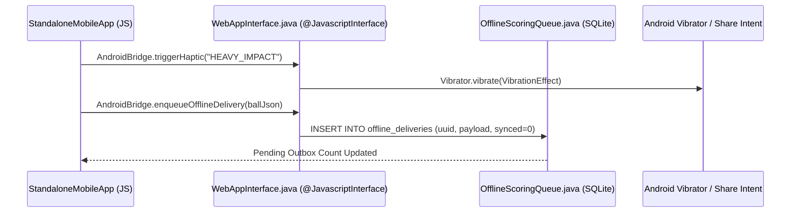

# 06 — Mobile Web, Native Android APK & iOS SwiftUI Architecture

---

## 1. Standalone Mobile App Engine (`apps/api/src/ui/mobile-view.ts`)

- **Single-File Offline-First Bundle (`dist/mobile.html`)**:
  - Compiled by `scripts/package-dist.mjs` directly into `dist/mobile.html`, `apps/mobile/android/app/src/main/assets/mobile.html`, and `apps/mobile/ios/CricOS/Resources/mobile.html`.
- **Slide-Out Left Sidebar Navigation Drawer (`#mobileSidebarDrawer`)**:
  - Triggered by top-left `☰` (`#btnMobileSidebarToggle`).
  - Contains:
    1. **Provisioned Account Personas (`#mobileSidebarPersonaStrip`)**
    2. **Persona-Scoped Core Workspaces (`#mobileSidebarWorkspaces`)**
    3. **3D, Gear Store & Tactical Studios (`#mobileSidebarStudios`)**: `🛍️ Pro Cricket Gear Store`, `🏟️ 3D Stadium Pitch`, `🎯 8-Zone Wagon Wheel`, `🔍 Command Palette (⌘K)`
    4. **Clean Focus Mode Toggle (`#btnMobileSidebarDeclutterToggle`) & Sign Out (`#btnMobileSidebarSignOut`)**

---

## 2. Native Android APK Architecture (`apps/mobile/android` $\rightarrow$ `dist/cricos-debug.apk`)

- **Build Command**: `./pipeline.sh apk` (runs Gradle `:app:assembleDebug` with Java 17 and copies the signed debug APK to `dist/cricos-debug.apk`).

---

## 3. Native iOS SwiftUI & WebKit Shell (`apps/mobile/ios`)

- Uses `WKWebView` with `WKScriptMessageHandler` (`CricOSNativeBridge`) to bridge `UIImpactFeedbackGenerator` Taptic Engine pulses, native share sheets, and offline storage.
