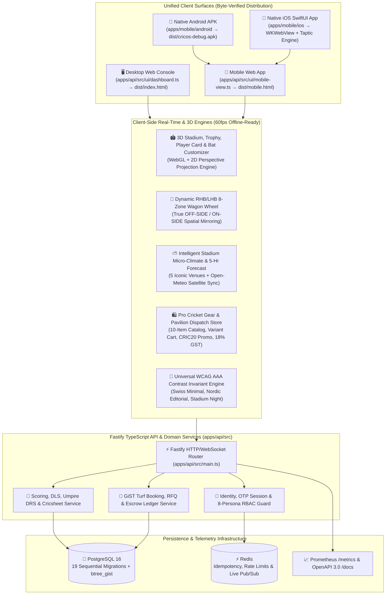

# 🏏 CricOS — Official Engineering & Product Wiki

Welcome to the official **CricOS Unified Cricket Operating System Wiki**. CricOS is a production-grade, full-stack cricket tournament, ball-by-ball live scoring, 60fps 3D stadium telemetry, intelligent micro-climate weather, turf/officials marketplace, and pro cricket gear commerce platform across **Desktop Web (`dist/index.html`)**, **Mobile Web (`dist/mobile.html`)**, **Native Android (`dist/cricos-debug.apk`)**, and **Native iOS (`apps/mobile/ios`)**.

---

## 🧭 Wiki Navigation & Reading Order

| Guide | Audience | Core Focus |
| :--- | :--- | :--- |
| **[01 — Principal Architecture Guide](./01-Principal-Architecture-Guide.md)** | Staff / Principal Engineers, Architects | Core architectural insight, C4 container topology, 19-migration PostgreSQL ER diagram, GiST concurrency & zero-dependency 3D projection engine |
| **[02 — Zero-to-Hero Onboarding](./02-Zero-to-Hero-Onboarding.md)** | New Engineers, Contributors | Progressive learning path (TypeScript/Fastify/Three.js foundations $\rightarrow$ Domain Model $\rightarrow$ `./pipeline.sh` workflow & 40+ term glossary) |
| **[03 — Live Scoring, 3D Stadium & Wagon Wheel](./03-Live-Scoring-3D-Stadium-and-Wagon-Wheel.md)** | Scoring & Graphics Engineers | Ball-by-ball state machine, RHB/LHB true `OFF-SIDE` vs `ON-SIDE` mirroring, 60fps 3D Stadium Pitch, Hawk-Eye DRS LBW & Cricsheet v1.0.0 export |
| **[04 — 8-Persona RBAC & Clean Focus UX](./04-8-Persona-RBAC-and-Clean-Focus-UX.md)** | Frontend & Security Engineers | Animated 60fps Hero Landing $\rightarrow$ Login $\rightarrow$ `allowedPersonas` strict RBAC lock, Clean Focus Mode decluttering & WCAG AAA Contrast Engine |
| **[05 — Intelligent Weather & Pro Gear Store](./05-Intelligent-Weather-and-Pro-Gear-Store.md)** | Product & Commerce Engineers | 5-stadium GPS micro-climate weather, 5-hour match forecast, pitch aerodynamics, and Pro Cricket Gear Store with 45-min Turf Pavilion Delivery |
| **[06 — Mobile, Native Android APK & iOS](./06-Mobile-Native-Android-APK-and-iOS-Architecture.md)** | Mobile & Native Engineers | `StandaloneMobileApp`, `WebAppInterface.java` bridge, offline SQLite delivery queue, Gradle APK compiler & iOS SwiftUI `WKWebView` |
| **[07 — API Reference, DB Schema & Testing](./07-API-Reference-Database-Schema-and-Testing.md)** | Backend & QA Engineers | Fastify REST endpoints, OpenAPI 3.0, double-entry escrow ledger, 185 Node domain tests & 70 Playwright E2E visual/functional suites |

---

## 🏗️ High-Level System Architecture



---

## ⚡ Quick Start & Universal Pipeline Commands

All build, test, packaging, Android APK compilation, and release operations are governed by [`pipeline.sh`](../pipeline.sh):

```bash
# 1. Run all 185 Node domain tests in compact low-token mode
./pipeline.sh test --summary

# 2. Package byte-for-byte verified Web, Mobile, OpenAPI & Native assets
./pipeline.sh package

# 3. Compile the native Android APK (dist/cricos-debug.apk)
./pipeline.sh apk

# 4. Run Playwright End-to-End Regression Suites
pytest tests/test_68_toast_dedup_and_mobile_sidebar_light_theme_contrast.py \
       tests/test_69_intelligent_venue_weather_and_forecast.py \
       tests/test_70_pro_gear_store_and_checkout.py -q

# 5. Automated Verified Ship (test -> package -> apk -> commit -> push)
./pipeline.sh ship "feat: description of verified change"
```
